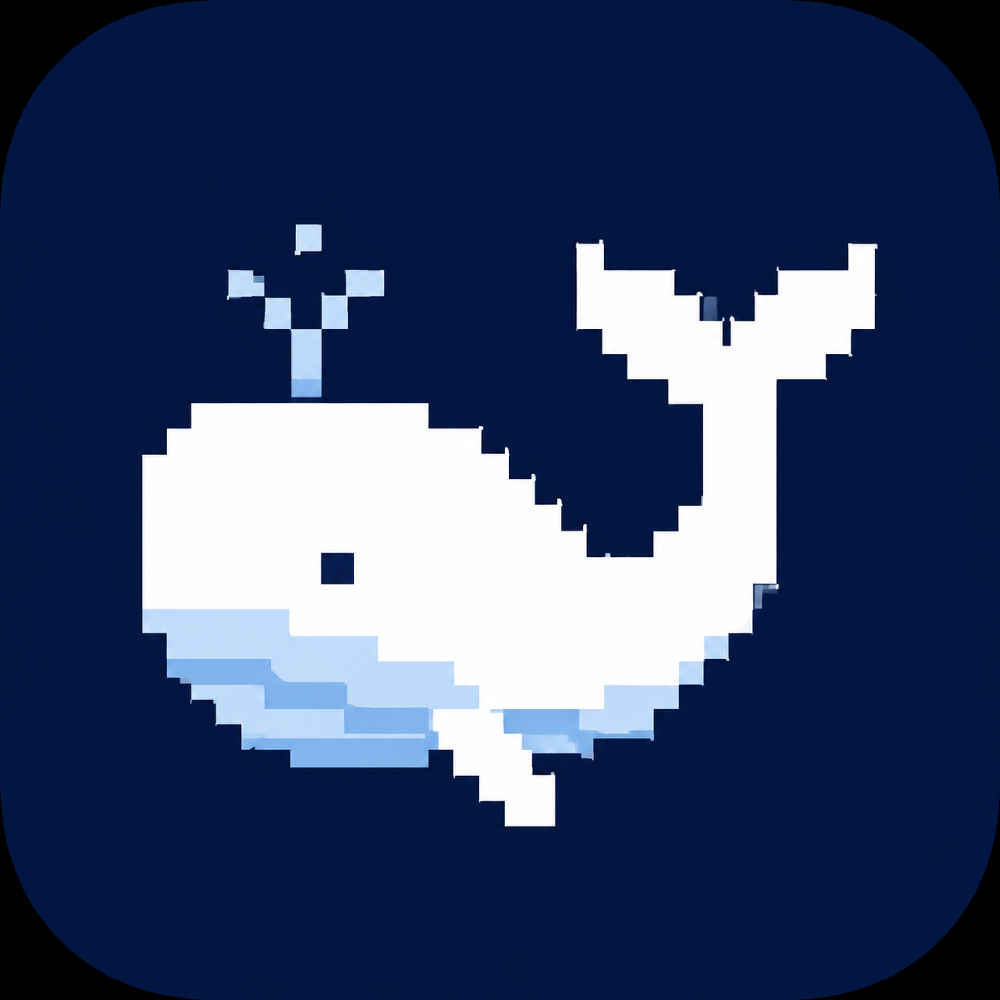

# DeepSeek Harness Desktop

> **DSH Desktop** — A native desktop client for [DeepSeek Harness](https://www.deepseek.com/harness/), built with Tauri 2 + React 19. It hosts the official DeepSeek Harness WebUI in a child webview and manages the local engine for you.

<p align="center">
  
</p>

<p align="center">
  
  
  
  
  
</p>

**Read this in other languages:** [简体中文](README.zh-CN.md) · [日本語](README.ja.md) · [한국어](README.ko.md) · [Español](README.es.md) · [Français](README.fr.md) · [Deutsch](README.de.md)

---

## 📦 Releases — Version Guide

Three variants are published. Pick the one that fits your students / users:

| Release | What it is | Size | Node.js required | Default chat language |
|---|---|---|---|---|
| **v0.1.12** | **Tauri shell** — native GUI (TitleBar/StatusBar/zoom) that embeds the official WebUI | 2.5 MB | ✅ **Yes** (engine fetched at runtime) | Follows engine persona |
|| **v0.1.12-chinese** | **Full portable engine, Chinese-first** — bundled Node.js + dsh + Chinese persona (简体中文思考/对话) | 52 MB | ❌ No | 🇨🇳 **Chinese** |
|| **v0.1.12-chinese-lite** | **Lite Chinese engine** — dsh + Chinese persona, uses system Node.js | 31 MB | ✅ Yes | 🇨🇳 **Chinese** |
|| **v0.1.12-full-english** | **Full portable engine, official English** — bundled Node.js + dsh (unmodified) | 52 MB | ❌ No | 🇬🇧 English |

**Which one to use?**
- **Students without Node.js** → `v0.1.12-chinese` (`DSH-Desktop-Chinese-Setup-v0.1.12.exe`) or `v0.1.12-full-english` (`DSH-Desktop-Full-English-v0.1.12.exe`) — zero dependencies, double-click to run
- **Chinese-first conversations, has Node.js** → `v0.1.12-chinese-lite` (31 MB, smallest Chinese package)
- **Chinese-first conversations, no Node.js** → `v0.1.12-chinese`
- **Existing Node.js environment / want the native GUI** → `v0.1.12` (2.5 MB shell)

> All three share the same engine (`@deepseek-ai/dsh@0.1.0-rc.6`). Data lives in `~/.dsh/` regardless of variant.

---

## ✨ What is it?

DeepSeek Harness Desktop is a **thin native shell** around the official DeepSeek Harness WebUI. Instead of reinventing the UI, it hosts the official web interface in a **child webview** — a real top-level document whose origin *is* `127.0.0.1`, not a cross-site `iframe` — and adds what a desktop app should have:

- **One-click engine startup** — detects your local environment (`node` + `dsh`), picks a free port, and spawns the engine with the right profile.
- **Reuse existing instances** — if a DeepSeek Harness web instance is already running on your machine, the app connects to it directly instead of starting a duplicate (no more fighting over `~/.dsh` session storage).
- **Environment self-check + one-click install** — missing Node.js or the `dsh` engine? The launcher tells you exactly what's missing and can install it for you.
- **Frameless window** — custom title bar (drag / minimize / maximize / close) and a status bar showing engine state, port, and zoom level.
- **Authenticated engine sessions** — engines ≥ 0.1.5 reject unauthenticated requests and issue a `SameSite=Strict` session cookie. The shell self-signs that cookie with the key from the managed credential store and injects it into the child webview, so the WebUI loads instead of showing a 401 page.
- **Auto-follows official updates** — since the UI is the official WebUI itself, when DeepSeek releases a new engine version the desktop app inherits every new feature, UI change, and model instantly after the engine update. No UI rewrite needed, ever.
- **Local persistence** — all sessions live on disk under `~/.dsh/sessions/`, so closing the app never loses your work.

Everything else — sessions, trajectories, plugins, agent presets, settings — is the **official DeepSeek Harness WebUI** at its full fidelity, since the app simply hosts it.

## 🚀 Quick start

1. **Download** the latest installer from [Releases](https://github.com/dongdong-agent/DSH-Desktop/releases) (`DSH Desktop_0.1.0_x64-setup.exe`, Windows x64), or copy the portable `dsh-desktop.exe` anywhere.
2. **Launch** the app. The launcher page shows your environment status (Node.js / npx / dsh engine).
3. Click **启动引擎 (Start Engine)**. The app spawns the engine (`dsh --profile web` on `127.0.0.1:17800` or another free port) and loads the official WebUI automatically.
4. Use it like the web version — sessions, plugins, trajectories, everything is there.

> First run: if Node.js or `dsh` is missing, use the **one-click install** buttons on the launcher page.

## 🖥 Platform support

| Platform | Status | How to use |
|---|---|---|
| **Windows x64** | ✅ **Officially supported** | Download from [Releases](https://github.com/dongdong-agent/DSH-Desktop/releases) or run the portable exe |
| **macOS (Apple Silicon / Intel)** | 🚧 Build from source | See below |
| **Linux (x64)** | 🚧 Build from source | See below |

**Windows is the primary platform** — installers and CI builds target it first. macOS and Linux builds work with Tauri 2 but are not yet shipped as prebuilt artifacts; build them from source:

```bash
# Prerequisites (any platform)
# - Node.js ≥ 18 (https://nodejs.org) — provides node + npx
# - Rust stable toolchain (https://rustup.rs)
# - Platform system deps for Tauri:
#   macOS:  Xcode Command Line Tools
#   Linux:  sudo apt install libwebkit2gtk-4.1-dev build-essential curl wget file \
#           libxdo-dev libssl-dev libayatana-appindicator3-dev librsvg2-dev

# Clone and build
git clone https://github.com/dongdong-agent/DSH-Desktop.git
cd DSH-Desktop
npm install
npm run tauri build     # produces .app (macOS) / .deb/.AppImage (Linux) in src-tauri/target/release/bundle/
```

**Cross-platform notes**:

- The app shell (Tauri 2) is fully cross-platform. The engine is the official `@deepseek-ai/dsh` npm package, which runs on all three platforms via Node.js.
- On macOS/Linux the engine is spawned through the `node` + `npx` fallback chain (the Windows-specific `dsh.cmd` / local `bin.js` paths are probed at runtime and skipped when absent).
- Engine sessions live in `~/.dsh/` on every platform — your sessions, profiles and credentials are portable across OSes.
- Want prebuilt macOS/Linux artifacts? Open an [issue](https://github.com/dongdong-agent/DSH-Desktop/issues) — the CI workflow can be extended to publish them.

## 🏗 Architecture

```
┌────────────────────────────────────────────────────┐
│  TitleBar  (custom frameless title bar + status dot)│
├────────────────────────────────────────────────────┤
│  child webview → official DeepSeek Harness WebUI   │
│  sessions / trajectories / plugins / settings —    │
│  top-level document at 127.0.0.1, so the engine's  │
│  SameSite=Strict session cookie is honored         │
├────────────────────────────────────────────────────┤
│  StatusBar (engine state · port · zoom)            │
└────────────────────────────────────────────────────┘
```

- **Frontend**: React 19 + TypeScript + Vite 6 + Tailwind CSS 4 + Zustand
- **Desktop shell**: Tauri 2 (Rust), frameless window with custom title bar
- **Engine lifecycle** (`src/lib/dshEngine.ts`): scan for existing instances → pick a free port → spawn (`node` + local `bin.js`, with `npx` / `dsh` / `dsh.cmd` fallbacks) → health-check → stop
- **Engine view** (`src-tauri/src/lib.rs`): a child webview (`mount_engine_view` / `set_engine_view_bounds` / `unmount_engine_view`) is positioned over the content area; the shell measures the host element and keeps the view in sync with window resizes and zoom
- **Session auth** (`src/lib/engineAuth.ts`): reads the browser-session signing key from `~/.dsh/.credentials.yaml` and generates an engine-verifiable cookie, injected on every `PageLoadEvent::Finished`
- **Diagnostics**: spawn attempts and failures are logged to `%TEMP%\dsh-spawn.log`

## 🧰 Tech stack

| Layer | Choice |
|---|---|
| Desktop shell | Tauri 2 (Rust), frameless + custom title bar |
| Frontend | React 19 + TypeScript + Vite 6 |
| Styling | Tailwind CSS 4 |
| State | Zustand 5 (a single `engine` store — the shell keeps no chat/session state) |
| Embedded UI | Official DeepSeek Harness WebUI via a Tauri **child webview** |

## 🛠 Development

```bash
npm install
npm run tauri dev          # dev mode (Vite on port 1422)
```

## 📦 Build

```bash
npm run build              # tsc + vite build
npm run tauri build        # production bundle (NSIS installer + portable exe)
```

Output: `src-tauri/target/release/bundle/nsis/DSH Desktop_0.1.12_x64-setup.exe`

## 📁 Project layout

```
src/
├── App.tsx                 # shell layout: TitleBar + child-webview host + StatusBar
├── lib/
│   ├── dshEngine.ts        # ★ engine lifecycle: findExistingInstance / startEngine / stopEngine
│   │                       #   + candidateCommands (spawn fallback chain) + probePort + diag log
│   ├── engineAuth.ts       # self-signed engine session cookie (managed credential store)
│   ├── updater.ts          # kernel version check / install / rollback
│   └── types.ts            # shared types (EngineHealth)
├── stores/                 # zustand store (engine)
└── components/
    ├── TitleBar.tsx        # custom title bar (drag / minimize / maximize / close)
    ├── StatusBar.tsx       # engine state · kernel version / rollback · zoom
    ├── EngineLauncher.tsx  # launcher: environment check + one-click install + start
    ├── CloseDialog.tsx     # close / minimize-to-tray / stop-and-exit
    └── KeyManagerDialog.tsx# managed API-key / credential management
src-tauri/
├── capabilities/default.json  # ★ permissions (shell spawn scope, window controls)
├── tauri.conf.json            # window / bundle config
└── src/lib.rs                 # child webview (mount/bounds/unmount) + plugin registration
```

## 🔍 Troubleshooting

- **Title bar buttons or dragging don't work** — `core:window:*` permissions (`allow-minimize` / `allow-toggle-maximize` / `allow-close` / `allow-start-dragging`) must be present in `src-tauri/capabilities/default.json`. Capabilities are compiled into the binary, so rebuild after editing.
- **Engine fails to spawn** — check `%TEMP%\dsh-spawn.log`. Common causes: missing `shell:allow-spawn`, missing program scope entries, or scope entries without the `cmd` field (non-sidecar entries require `cmd`). See the log for the exact error.
- **WebUI blank / "authentication required"** — engines ≥ 0.1.5 require a session cookie and mark it `SameSite=Strict`. An `iframe` inside the shell page (`tauri.localhost`) is a cross-site context, so the cookie would never be sent — that is exactly why the engine UI is hosted in a **child webview** instead. If you see a 401 page, check that `~/.dsh/.credentials.yaml` still contains `client-connection/browser-session`; without that signing key no cookie can be generated.
- **Engine view misaligned after zoom** — the shell converts CSS pixels to logical pixels via the current zoom factor before calling `set_engine_view_bounds`. If you change the layout, keep the host element's bounds and the zoom conversion in sync.

## 📄 License

[MIT](LICENSE) © 2026 dongdong-agent
